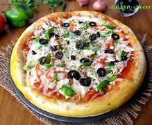

# Yalagandula Gokul Aadarsh
The mix of delicate chicken and oozy, melted cheese creates a delectable symphony of aromas and textures, which is why I adore chicken extra cheesy pizza. Every taste is decadent and gratifying as the thick, creamy cheese melds flawlessly with the flavorful chicken. Every slice is appealing because of the extra cheese's beautifully rich touch.

Here's a picture of a chicken cheese pizza

***

## Recommended Restaurants
Below is a table in which I mentioned the Names, location and the reason to visit the restaurant.
| Restaurant Name | Reason for Recommendation | Location |
| --- | :--- | --- |
| Pizza Haven | Known for its rich, creamy extra cheesy chicken pizza and generous toppings. | 123 Main Street, Cityville |
| Cheesy Crust Pizzeria | Offers a unique blend of cheeses and perfectly seasoned chicken. | 456 Oak Avenue, Townsville |
| Chicken & Cheese Delight | Famous for its deliciously crispy crust and flavorful chicken | 789 Elm Road, Villageburg |
|The Pizza Spot|Renowned for its flavorful chicken and exceptional cheese blend.|101 Maple Lane, Brooktown|
